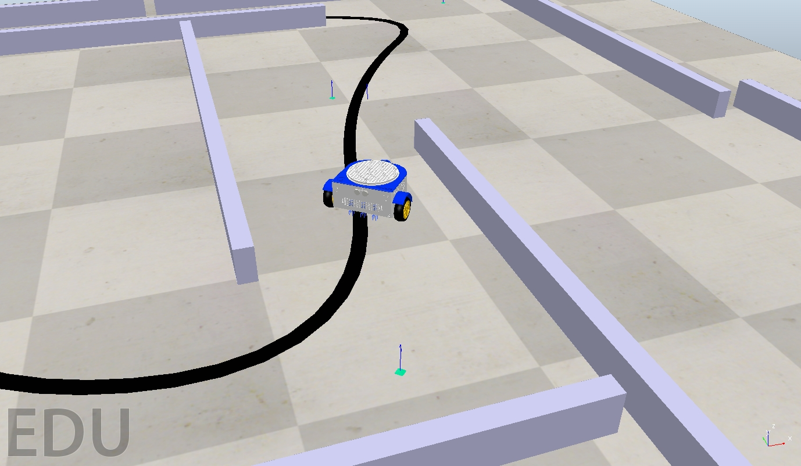
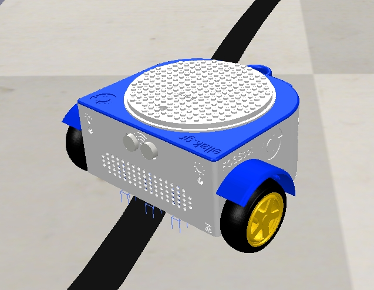

# FOSSBOT Coppelia Simulation

Fossbot robot for Coppelia with python example code for controling and sensing.

## Instructions 
* Download the Coppelia Simulator https://www.coppeliarobotics.com/downloads
* Start the simulation
* Use the test_fossbot.py for your expirements

### Make sure you have following files in your directory, in order to run the various examples:

1. sim.py
2. simConst.py
3. the appropriate remote API library: "remoteApi.dll" (Windows), "remoteApi.dylib" (Mac) or "remoteApi.so" (Linux)
4. simpleTest.py (or any other example file)

